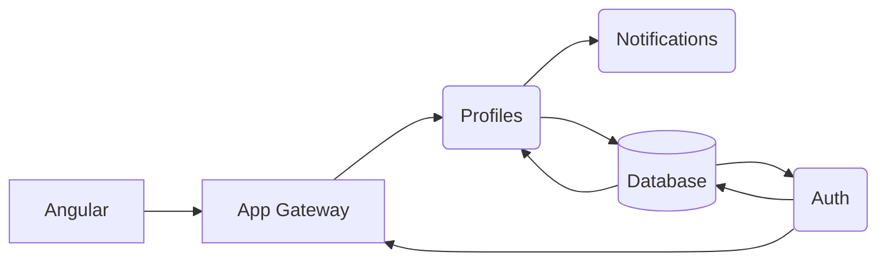
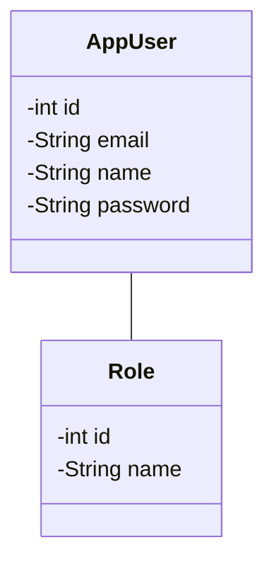

# Microservices

```mermaid
graph LR
A[Angular] --> B[App Gateway]
F(Auth) --> B
B --> D(Profiles)
D --> E(Notifications)
G[(Database)] --> F & D
D & F --> G
```
# Classes

```mermaid
classDiagram
			AppUser--Role
      class AppUser{
		      -int id
          -String email
          -String name
          -String password

      }
      class Role{
          -int id
          -String name
      }
```
